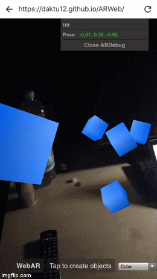
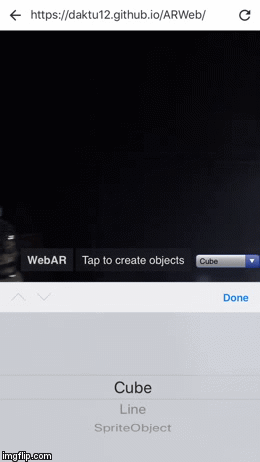
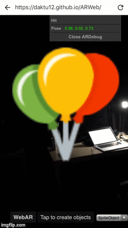

# WebAR
Sample AR project built on Google's new [three.ar.js](https://developers.google.com/ar/develop/web/getting-started). The AR application can be run from a custom mobile browser.

## Prerequisites
1. Install WebARonARCore(Android) or WebARonARKit(iOS) on your phone. Follow [these](https://github.com/google-ar/WebARonARKit) instructions for iOS and [these](https://github.com/google-ar/WebARonARCore) for Android.
2. Make sure you have the needed hardware and software to install the browsers.

## Run
### Running my project
1. Navigate to https://nagam11.github.io/WebAR/
### Running your own project
1. git clone https://github.com/nagam11/WebAR.git
2. Create a new branch and name it "gh-pages"
3. Navigate from the installed browser on your phone to https://YOUR-USERNAME.github.io/WebAR/

## ToDos
1. Scale down Sprite Image
2. Add touch events
